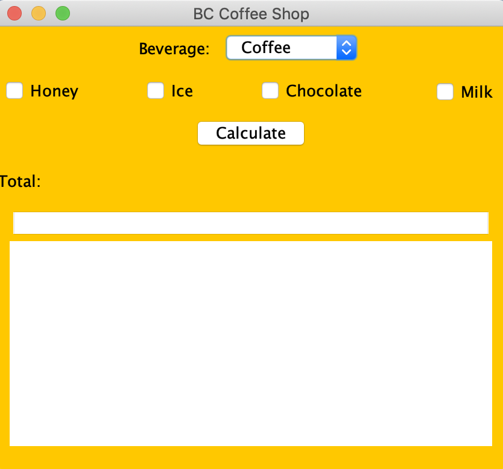
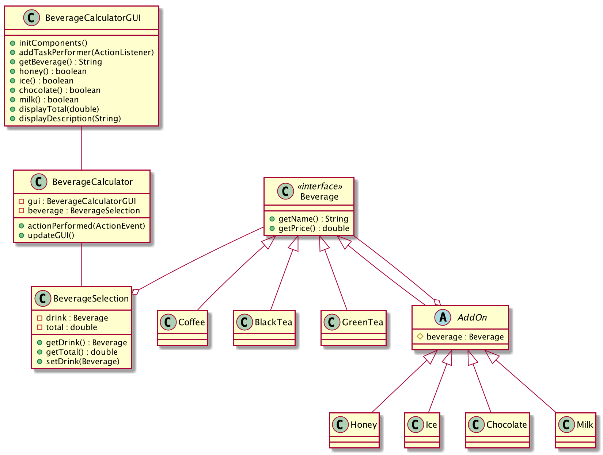

# beverage-price-calculator
> A price calculator for beverages

## Table of contents
* [General info](#general-info)
* [Screenshots](#screenshots)
* [Technologies](#technologies)
* [Setup](#setup)
* [Features](#features)
* [Status](#status)
* [Contact](#contact)

## General info
This is a Java application using the decorator software design pattern.

## Screenshots

## Technologies
* Java 11

## Setup
Download src folder and open it in your local Java IDE

## Features
List of features ready and TODOs for future development
* Select beverage
* Select beverage add-on
* Display total price
* Display beverage description

## Status
Project is finished

## Contact
Created by [CherylTan](https://www.linkedin.com/in/cheryl-tan-72176684/) - feel free to contact me!
